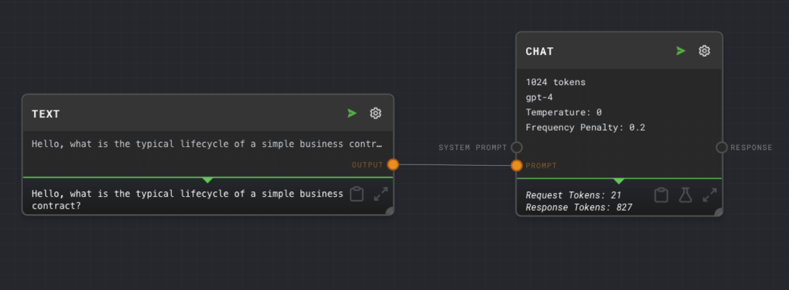

# Simple Graph

In the sidebar you should see the graphs tab with a list of 7 graphs. These are the graphs that are included in the tutorial project.

Click on the first graph, `1. Simple Graph`, to open it.

You should see the following graph:

This graph has 2 nodes. A [text](../node-reference/text) node and a [chat](../node-reference/chat) node.

Click the green run button in the top right corner of the graph to run this graph.

You should see something similar to the following:

When you ran the graph, the text node sent it's output to the prompt of the chat node. The chat node then sent a post request to OpenAI's [create](https://platform.openai.com/docs/api-reference/chat/create) endpoint and received a response. The response was then sent to the output of the graph.

Let's experiment with the nodes in this graph. To change the parameters of a node, click on the edit gear in the top right on the node.

## Experiments

 - Change the text node to ask a new question like "What's the difference between a NDA and a MNDA". Run the graph again and observe the chat node respond with new text.

 - Change the chat nodes max tokens to 256. Run the graph again and observe the chat node respond with less text.

 - Change the chat nodes temperature to 1. Run the graph again and observe the chat node respond with more variable text.

 