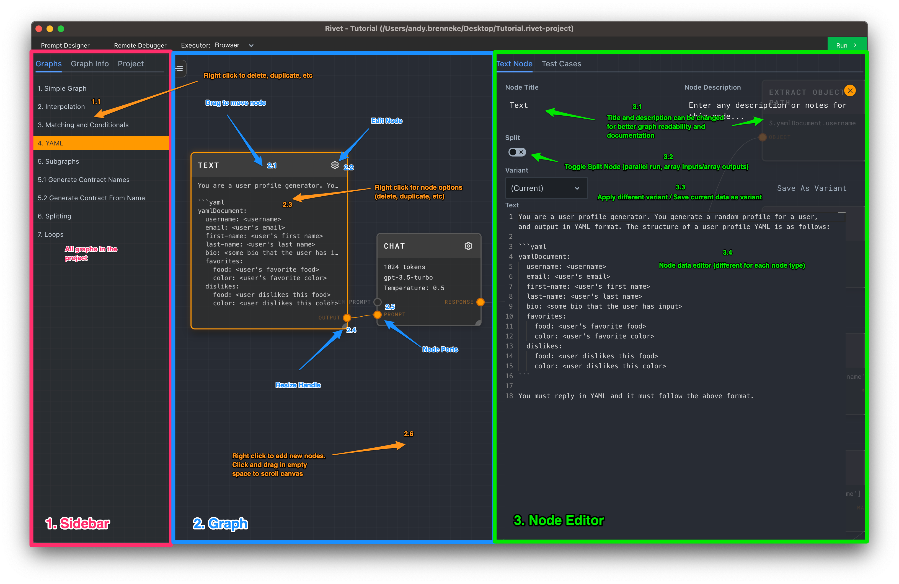

Above is a quick annotated overview of the main Rivet interface. The main areas are:

## 1. Sidebar

### Project Info Tab

In the project info tab you can set the name and description of your project. This data is saved with your project file and used for documenting your project.

### Graphs Tab

The graphs tab is where you can navigate between all graphs in your project, add new graphs, and delete/duplicate existing graphs.

#### 1.1 Graph List

Clicking on a graph in the list will open it in the main graph area. To add a new graph, right click in the blank space in the graph list and select "New Graph".

To delete a graph, right click on it and select "Delete Graph". This will delete the graph from your project. (**Warning** there is no undo at this time!)

To duplicate a graph, right click on it and select "Duplicate Graph". This will create a new graph with the same nodes and connections as the original graph.

### Graph Info Tab

In the graph info tab you can set the name and description of your graph. This data is saved with your project file and used for documenting your graph.

## 2. Graph

You will mainly be working in the Graph area of the interface. It contains all of your nodes in the current graph and the connections between them.

### 2.1 Node Title Bar

Shows the title of the node. Click and drag on the title bar to move the node around the canvas.

Hold shift and click the title bars on multiple nodes to select multiple nodes at once. You can then move all of the selected nodes as a group, or create a subgraph from the selected nodes.

### 2.2 Edit Node

Click the edit node icon to edit the current node and open the [Node Editor](#3-node-editor).

### 2.3 Node Body

Shows the current configured data on the node, such as the text of a [Text Node](../node-reference/text) or the configuration of a [Chat Node](../node-reference/chat).

Right click in the node body or the node title to delete or duplicate the node.

### 2.4 Resize Handle

You can resize the node horizontally by clicking and dragging on the resize handle.

### 2.5 Ports

Ports are the connection points on the node. Ports can be inputs or outputs. Inputs are on the left side of the node and outputs are on the right side of the node.

Click and drag from a port to another port to create a connection between the two ports.

Click on a connected port to move the connection to a different port, or click and drag to an empty space for an existing connection to delete the connection.

### 2.6 Canvas

The canvas is the main area of the graph. You can click and drag on the canvas to move the graph around. You can also use the scroll wheel to zoom in and out.

Right click to open the context menu to add new nodes.

## 3. Node Editor

The node editor is visible when you click the edit node icon on a node. It is used to edit the data on the node.

You can close the node editor by clicking the close button in the top right, by pressing the escape key, or by clicking on any blank space in the graph.

### 3.1 Node Title & Description

You can edit the title of the node in the node editor (changes the title shown on the graph). You can also edit the description of the node in the node editor, for documentation purposes.

### 3.2 Split Node

Toggles whether the node is a split node. For more information on split nodes, see the [Splitting](./splitting) documentation.

When splitting is enabled, the number input next to the split toggle is the **maximum split amount**. This is a safeguard for excessive splitting. If the data exceeds the maximum split amount, only the first N items will be executed, where N is the maximum split amount.

### 3.3 Variants

Variants are used to create multiple versions of the same node. The button on the right allows you to save the current node configuration as a new variant. The dropdown on the left allows you to apply existing variants to the current data on the node.

Variants allow you to save slight differences to a node, and test them without losing the data. For example, you may have a [Text Node](../node-reference/text) with a message to an LLM. You may want to test different variations of the message to see which one performs better and gives better AI results.

### 3.4 Node Data Editor

This area contains the editors for the currently selected node. The editor will change depending on the type of node you are editing. For example, the [Text Node](../node-reference/text) has a text editor, and the [Chat Node](../node-reference/chat) has a chat configuration editor.

## Menu Bar

### Prompt Designer

Toggles whether the Prompt Designer is visible. The Prompt Designer is currently in development.

### Remote Debugging

Clicking the Remote Debugging button will open up the remote debugger connect panel. You can enter a remote debugger URI to connect Rivet as a remote debugger to a server.

While connected, click remote debugger button again to disconnect.

### Executor

Allows you to select the current executor that Rivet will use. See the [Executors](./executors) documentation for more information.

### Run

Clicking the run button will run the current graph.

### Abort

Visible while a graph is running. Clicking the abort button will abort the current graph.

### Pause/Resume

Visible while a graph is running. Clicking the pause button will pause the current graph, and clicking the resume button will resume the current graph from where it was paused.
